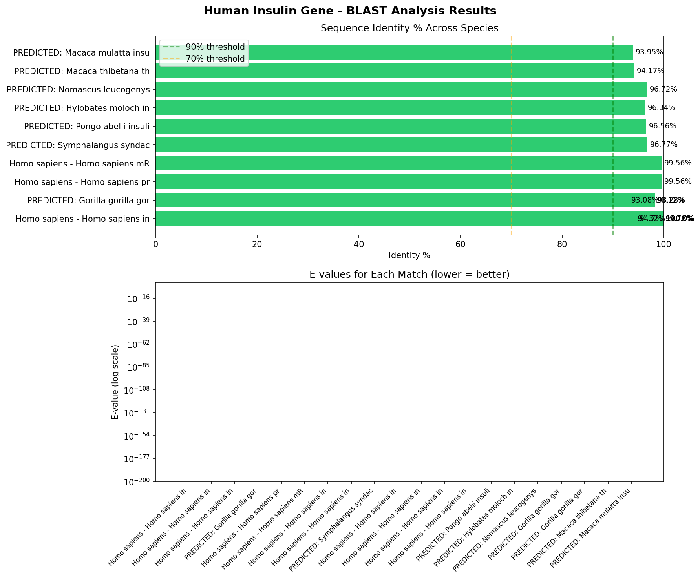
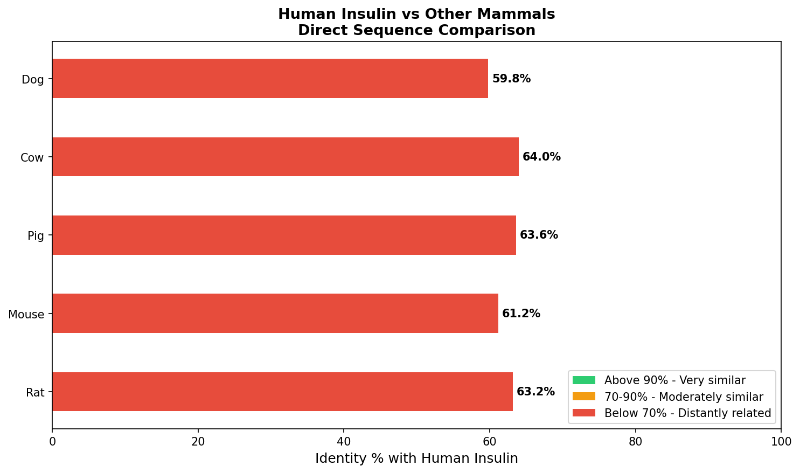

# Task 1: DNA/Protein Sequence Analysis
## Human Insulin Gene - BLAST Analysis
### CodeAlpha Bioinformatics Internship

---

## Overview
This project performs a complete DNA sequence analysis of the **Human Insulin Gene (NM_000207)** using BLAST (Basic Local Alignment Search Tool). The analysis identifies homologous sequences across multiple species and visualizes the evolutionary relationships through sequence similarity.

---

## What is BLAST?
BLAST (Basic Local Alignment Search Tool) is a sequence similarity search tool that compares a query sequence against a database of known sequences. It identifies homologous sequences — sequences that share a common evolutionary ancestor — by finding regions of similarity.

---

## Objectives
- Download the human insulin DNA sequence from NCBI
- Perform BLAST analysis to find homologous sequences
- Document similarity, identity percentage, and alignment scores
- Compare human insulin with other mammalian species directly
- Visualize results through charts and graphs

---

## Tools & Technologies
| Tool | Purpose |
|------|---------|
| Python 3.14 | Core programming language |
| BioPython | Biological sequence analysis |
| NCBI Entrez | Fetching sequences from database |
| NCBI BLAST | Finding homologous sequences |
| Matplotlib | Data visualization |
| Git & GitHub | Version control |

---

## Dataset
- **Sequence:** Human Insulin Gene mRNA
- **Accession ID:** NM_000207
- **Database:** NCBI Nucleotide Database
- **BLAST Database:** nt (all nucleotide sequences)
- **Comparison Species:** Rat, Mouse, Pig, Cow, Dog

---

## Results

### BLAST Analysis - Top Matches
| Species | Identity % | E-value |
|---------|-----------|---------|
| Homo sapiens (insulin isoform) | 100% | ~0 |
| Homo sapiens (preproinsulin) | 99.56% | ~0 |
| Gorilla gorilla | 98.28% | ~0 |
| Symphalangus syndactylus | 96.77% | ~0 |
| Pongo abelii (Orangutan) | 96.56% | ~0 |
| Hylobates moloch | 96.34% | ~0 |
| Nomascus leucogenys | 96.72% | ~0 |
| Macaca thibetana | 94.17% | ~0 |
| Macaca mulatta | 93.95% | ~0 |

### Direct Species Comparison
| Species | Identity % with Human |
|---------|----------------------|
| Cow | 64.0% |
| Pig | 63.6% |
| Rat | 63.2% |
| Mouse | 61.2% |
| Dog | 59.8% |

---

## Key Findings
- Human insulin shows **93-100% identity** with other primate species
- The closer the evolutionary relationship, the higher the sequence identity
- All BLAST matches have E-values close to zero — confirming real biological matches, not random chance
- Pig insulin (63.6% mRNA identity) was historically used to treat human diabetes due to protein-level similarity
- Non-primate mammals show lower mRNA identity because non-coding regions evolve faster than protein-coding regions

---

## Visualizations
### Chart 1: BLAST Results - Primate Sequence Identity


### Chart 2: Direct Mammal Comparison


---

## How to Run
```bash
# Clone the repository
git clone https://github.com/sharmis0713-bit/CodeAlpha_Bioinformatics-DNA.git

# Install dependencies
pip install biopython matplotlib

# Run the analysis
cd Task1_DNA_Sequence_Analysis
python sequence_analysis.py
```

---

## Project Structure

---

## Author
**Sharmi S**
B.Sc. Artificial Intelligence & Machine Learning
Hindusthan College of Arts and Science, Coimbatore
CodeAlpha Bioinformatics Internship — 2026